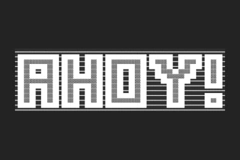
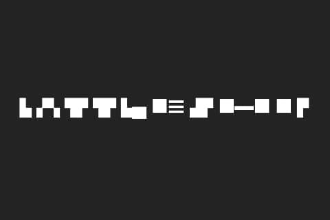
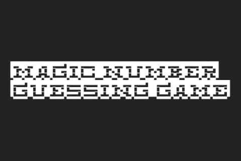
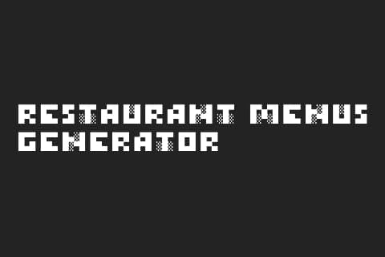
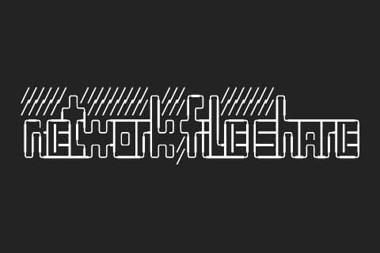

# Home

<link rel="apple-touch-icon" sizes="180x180" href="/apple-touch-icon.png">
<link rel="icon" type="image/png" sizes="32x32" href="/favicon-32x32.png">
<link rel="icon" type="image/png" sizes="16x16" href="/favicon-16x16.png">
<link rel="manifest" href="/site.webmanifest">

## My Programming Projects

\*For access to my private repositories, please
[email me](mailto:mpotoole@outlook.com?subject=GitHub%20Access) with the subject line, GitHub
Access.

---

### [Ahoy! | CSCI 499](project/ahoy)

---

### [Battleship | CSCI 235](project/battleship)

---

### [Magic Number Guessing Game | CSCI 301](project/magicnumber)

---

### [Restaurant Menus Generator | CSCI 325](project/menusgenerator)

---

### [Network File Share | CSCI 332](project/fileshare)

---

## Ethics Papers

### [Can Hackers Use Their Knowledge for Good?](/pdf/hackersforgood.pdf)

- **Class:** CSCI 235
- **Grade:** A

### [Rights, Agreements and the Usage of Code](/pdf/usageofcode.pdf)

- **Class:** CSCI 301
- **Grade:** A

### [Intellectual Property](/pdf/intellectualproperty.pdf)

- **Class:** CSCI 332
- **Grade:** B

---

## Presentations

### [Ethical Hacking - What Is It and How Does It Help Us?](/pdf/ethicalhacking.pdf)

- **Class:** CSCI 405
- **Grade:** A

### [ Returned Oriented Programming - How Is It Affecting Us?](/pdf/roping.pdf)

- **Class:** CSCI 330
- **Grade:** A
